# FlashCards Console Application

This is console application allows users to create new stacks and add flashcards. It allows users to study the flashcards they created. It also provides a study report for user to recap their study session history.

This application was developed by c#/.Net and MSSQL.

## Features

### Main Menu

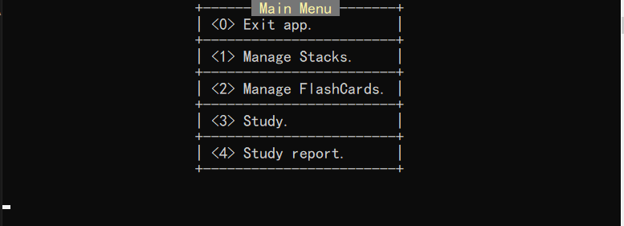

### Stacks

Show the initial stacks.

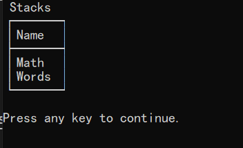

Add a new stack `Test`.

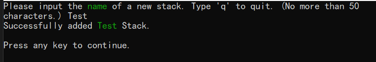

Show all stacks after add `Test` stack.

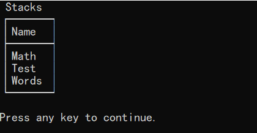

Delete `Words` stack. **Note that the flashcards belong to this stack will be delete.**

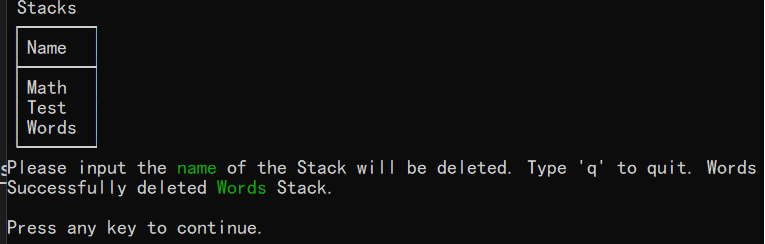

Show all stacks after deleting `Words` stack.

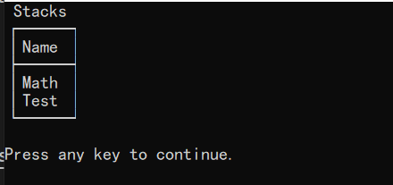

### FlashCards

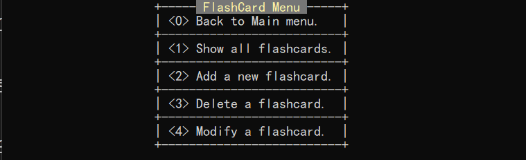

Show the inital flashcards.(The flashcards belong to Words stack have been delete.)

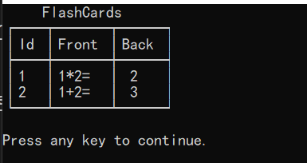

Add a new flashcard belongs to Test stack.

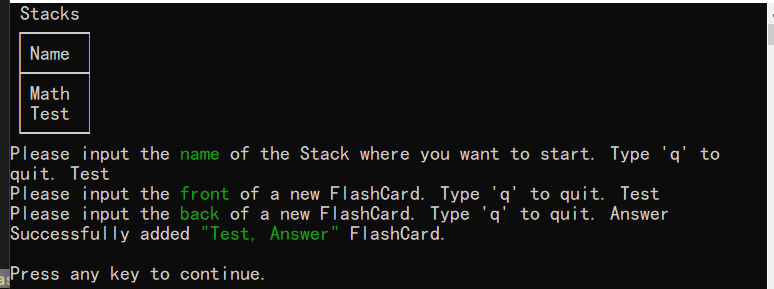

Show all flashcards after adding the new flashcard.

Delete a flashcard.

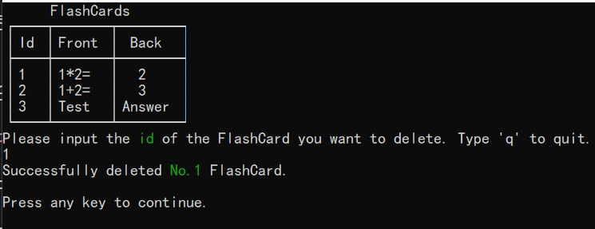

Show all flashcards after deleting a flashcard.

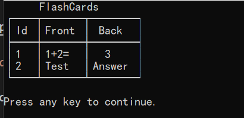

Modify a flashcard.

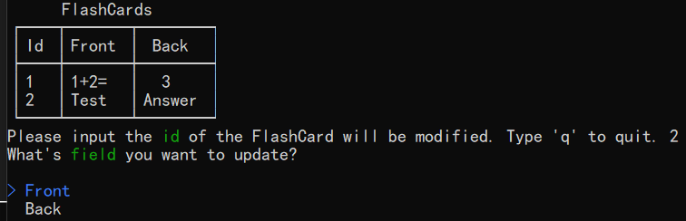

Show all flashcards after modifing a flashcard.

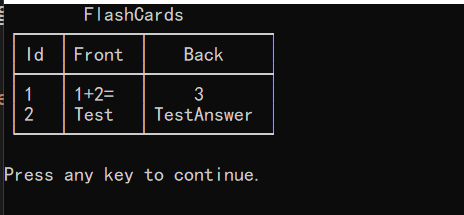

### StudySession

The unit of study time is **minute**.

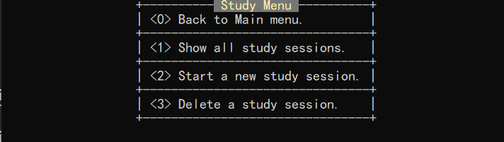

Show initial study sessions.

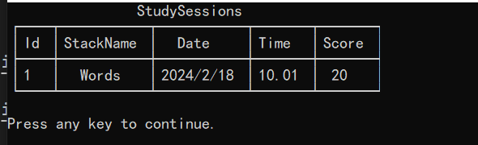

Start a new Study.

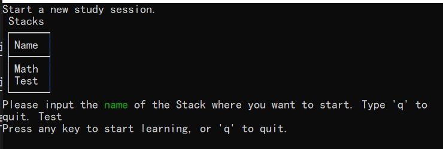
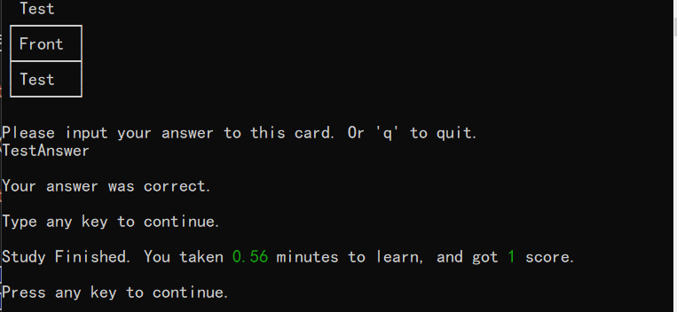

Show study sessions after finishing a new study.

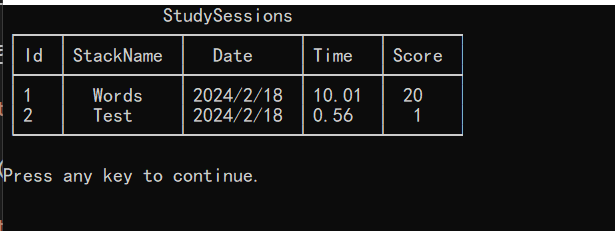

Delete a study session.

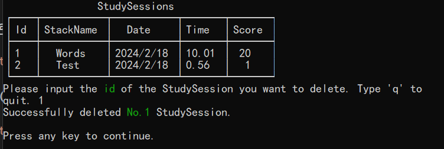

Show all study session after deleting a record.

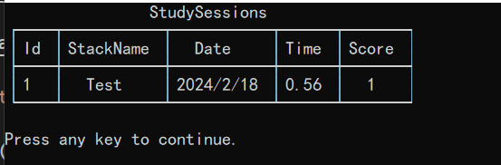

### StudyReport

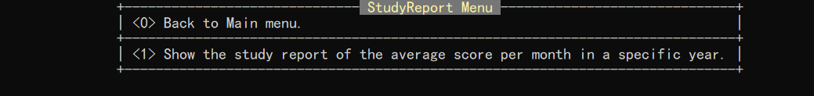

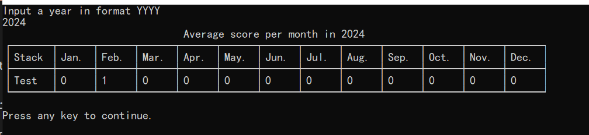

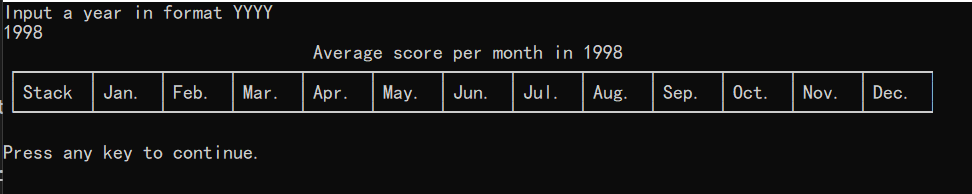

## References

* <https://spectreconsole.net/quick-start>
* <https://www.c-sharpcorner.com/UploadFile/8911c4/pivot-examples-in-sql-server/>
* <https://www.sqliz.com/posts/c-sharp-crud-sqlserver/>
* Of course. And many posts of StackOverflow.
* [markdownlint](https://marketplace.visualstudio.com/items?itemName=DavidAnson.vscode-markdownlint)
