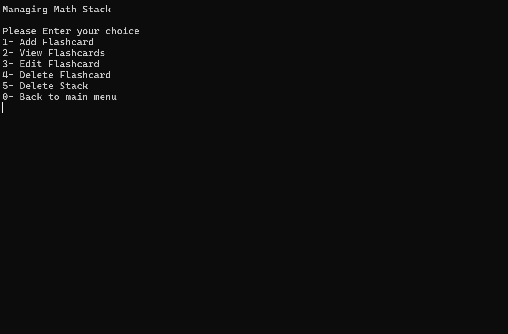
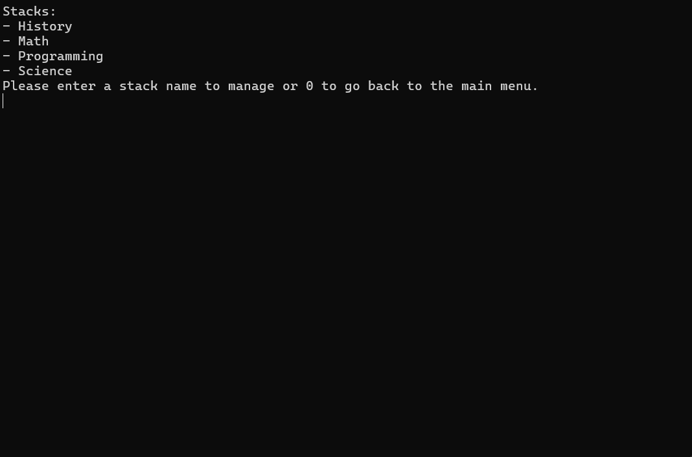
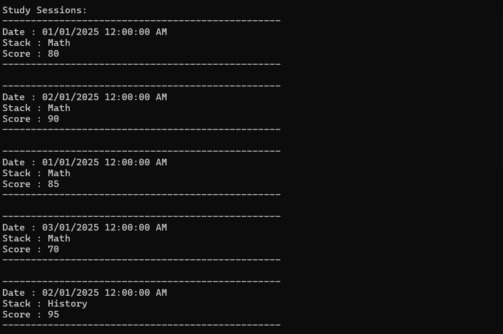
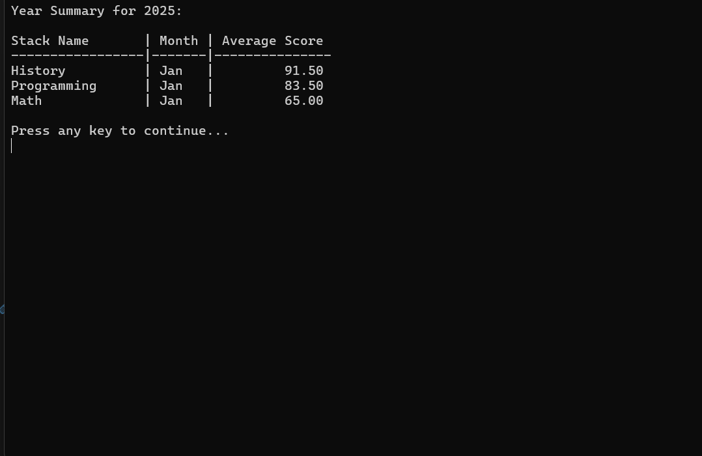

# Flashcards App

The **Flashcards App** is a console-based C# application designed to help users
create, manage, and study flashcards efficiently. It leverages **SQL Server** for
data persistence and introduces key concepts such as relational database design,
cascade deletes, and Data Transfer Objects (DTOs).

## Overview

This project demonstrates how to build a functional and structured application
using modern C# practices while integrating a database to store and manage data
effectively.

## Features

- **Create and manage stacks of flashcards**: Organize flashcards into stacks for
  better management.
- **Sequential IDs for flashcards**: Flashcards are displayed with sequential IDs
  starting from `1`, ensuring no gaps even after deletions.
- **Study specific stacks**: Record session scores while studying specific stacks.
- **View study session summaries**: Analyze study sessions for a specific year.
- **Customizable connection string**: Configure the connection string in the
  project file to point to your SQL Server instance.
- **Yearly summary of sessions**: View a yearly summary grouped by stack, showing
  average scores for each month.

## Technologies Used

- **Programming Language**: C#
- **Database**: SQL Server
- **Libraries**: Entity Framework, LINQ
- **Other**: .NET SDK (version 6.0 or above)

## Installation and Usage

### Prerequisites

1. Install the .NET SDK (version 6.0 or above).
2. Clone this repository:

   ```bash
   git clone https://github.com/your-username/flashcards-app.git
   ```

3. Configure the connection string in the project file to point to your SQL Server
   instance.

### Steps to Run the Application

1. Open the project in Visual Studio or your preferred IDE.
2. Restore NuGet packages:

   ```bash
   dotnet restore
   ```

3. Build the application:

   ```bash
   dotnet build
   ```

4. Run the application:

   ```bash
   dotnet run
   ```

## How It Works

### 1. Flashcards Management

- Users can create, view, or delete flashcards within stacks.
- Flashcards are displayed with sequential IDs starting from `1`.

### 2. Study Sessions

- Users can study specific stacks and record session scores.
- Session data is stored in the database for later analysis.

### 3. Yearly Summary

- View a summary of study sessions for a specific year.
- Data is grouped by stack and shows average scores for each month.

### 4. Manage Stacks

- Create and manage stacks of flashcards.
- View all recorded study sessions.

## Key Learnings

- Building database-driven applications using C# and SQL Server.
- Designing a scalable and efficient database structure.
- Implementing features like cascade deletes and Data Transfer Objects (DTOs).

## Screenshots

### Main Menu


This is the main menu where users can navigate through the application's various
features.

### Manage Stacks



The interface for managing stacks. Users can add, view, or delete stacks from here.

### Viewing Stacks



A detailed view of the available stacks, displaying their unique names.

### Study Sessions



Displays all recorded study sessions.

**Note:** The time here is `12:00:00 AM` because SQL was used
to insert test data for a larger sample. During actual usage, the application
records the real session time.

### Yearly Summary



A summary of the study sessions for a specific year, grouped by stacks and showing
the average scores for each month.
