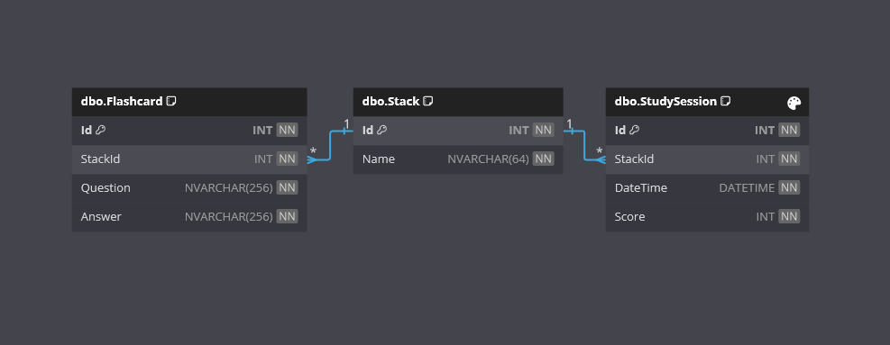

<h1>Flashcards</h1>

Welcome to the Flashcards App!

This is a C# project designed to demostrate working with SQL Server and Data Transfer Objects (DTOs) for versatile object handling.

## Requirements

1. **Stacks and Flashcards**: 
    - [x] Users can create stacks of flashcards.
    - [x] Two tables are required: one for stacks and one for flashcards, linked by a foreign key.
    - [x] Stacks must have a unique name.
    - [x] Each flashcard must belong to a stack. Deleting a stack should also delete its flashcards.
    
2. **Data Transfer Objects (DTOs)**:
    - [x] Use DTOs to display flashcards to users without including the stack ID.
    
3. **Study Sessions**:
    - [x] Create a "Study Session" area where users can study stacks.
    - [x] Record all study sessions with date and score.
    - [x] Link study sessions to stacks. Deleting a stack should also delete its study sessions.
    - [x] Users can view all their study sessions. Study session records are immutable (no updates or deletes).

### Additional Requirements

4. **Study Session Reports**:
    - [x] The number of study sessions per month per stack.
    - [x] The average score per month per stack.

## Features

- **Studying**
 
	Study your stacks of flashcards. A study session will be added to the database after to record the date and score.

- **Reporting**

	View all study session entries from the database, or view a total/average monthly report for a year.

- **Management**

	Add, update or delete stack and flashcard entries in the database.

- **Database Seeding**

	Set `SeedDatabase` to `true` in the appsettings.json file if you wish to generate mocked up seed data on initial database creation.

## Getting Started

### Prerequisites

- .NET 8 SDK installed on your system.
- A code editor like Visual Studio or Visual Studio Code
- SQL Server
- SQL Server Management Studio (SSMS)

### Installation

1. Clone the repository:
	- `git clone https://github.com/cjc-sweatbox/flashcards.git`

2. **EITHER**: Open SSMS and run database publish script
    - `.\_resources\Flashcards.Database.publish.sql`

3. **OR**: Open the solution in visual studio and publish the database:
	- `.\src\Flashcards.sln`
   - Right click the Flashcards.Database project and publish to your Local SQL Server instance.

4. Configure the application:
    - Navigate to `.\src\Flashcards.ConsoleApp\`
    - Update the `App.config` file with your database connection string.

5. Build the application:
    `dotnet build`

### Running the Application

1. Run the application using the .NET CLI in the ConsoleApp project directory:
	- `dotnet run`

### Usage

- **Database Seeding**: On initial startup, database seeding may be performed if App.config setting is set.
- **Main Menu**: Select an option to perform.
- **Study**: Select a stack of flashcards to study, review flashcards, and record your score.
- **View Study Sessions**: Display all your study sessions with dates and scores.
- **View Study Sessions Reports**: Choose to display a monthly total sessions, or a monthly average score for all your study sessions for a year.
- **Manage Stack**: Add, update of delete a stack. Stack names must be unique. Note: Deleting a Stack will also delete all linked Flashcard and StudySession data for that Stack.
- **Manage Flashcard**: Add, update or delete a flashcard.

## How It Works

- **Console Application**: Display is mostly through the [Spectre Console](https://spectreconsole.net/) library.
- **Menu Navigation**: Navigate the application through the Selection Prompts class provided by Spectre to perform actions.
- **Data Storage**: An SQL Server database is required to be created before running the application.
- **Data Access**: Stored procedures are used for the database access methods.
- **Data Seeding**: If the associated configuration setting is set and there are no Stacks in the database, a set of mock objects will be added.
- **Report Display**: Uses the Tables class provided by Spectre to display structured and formatted tables.

## Database

## Contributing

Contributions are welcome! Please fork the repository and create a pull request with your changes. For major changes, please open an issue first to discuss what you would like to change.

## License

This project is licensed under the MIT License. See the [LICENSE](./LICENSE) file for details.

## Contact

For any questions or feedback, please open an issue.

---
***Happy Flashcarding!***
