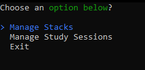
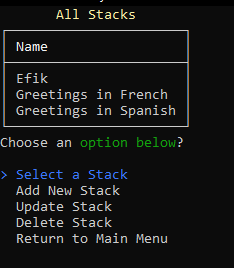
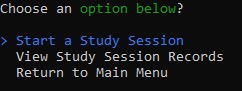
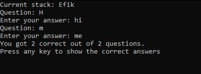
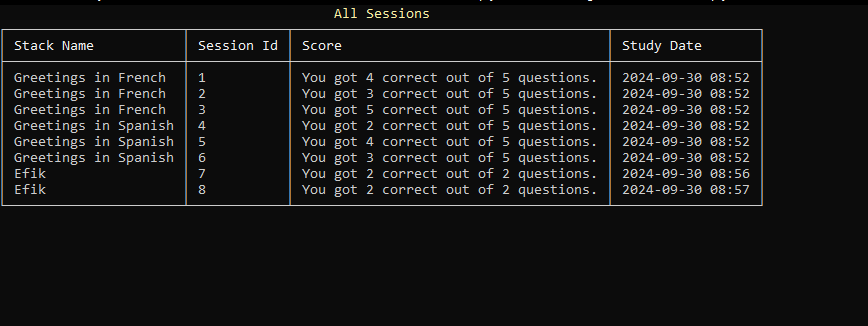

# Flashcards

## Overview

The Flashcards application is a console application designed to help users create and manage stacks of flashcards for studying. Users can add, update, view, and delete flashcards, as well as track their study sessions and scores. The application uses a SQL Server database for data storage and employs DTOs and pivot tables for reporting.

## Requirements

### Functional Requirements
- **Add Flashcard**: Users can add new flashcards to stacks.
- **Update Flashcard**: Users can update existing flashcards.
- **View All Flashcards**: Users can view all flashcards in a stack.
- **Delete Flashcard**: Users can delete specific flashcards from a stack.
- **Create Study Session**: Users can create and log study sessions with scores.

### Technical Requirements
- **Database**: SQL Server
- **ORM**: Dapper
- **Configuration**: `app.config` for database connection settings

## Features

- **CRUD Operations**: Create, Read, Update, and Delete operations for flashcards.
- **Dynamic Stack Management**: Allows users to manage multiple stacks of flashcards.
- **Session Tracking**: Users can track study sessions and scores for each stack.
- **Report System**: Provides reporting on the number of sessions and average scores per stack.

## Challenges Faced and Lessons Learned

- **Understanding Foreign Key Relationships**: I initially struggled with how to properly link flashcards to their respective stacks in the database but learned to leverage foreign key constraints effectively.
- **Managing Dynamic User Inputs**: Implementing dynamic StackIds required careful handling of user input and SQL queries to ensure data integrity.
- **Debugging SQL Queries**: Debugging issues with SQL queries was challenging; learning to log and trace SQL commands helped identify errors.
- **Implementing DTOs**: Using DTOs to transfer data between layers added complexity but improved the structure and maintainability of the application.

## Areas for Improvement

1. **User Interface Enhancements**: The console interface could benefit from improved navigation and user prompts for a more intuitive experience.
2. **Error Handling**: More robust error handling and feedback mechanisms could enhance user experience, especially for invalid inputs.

