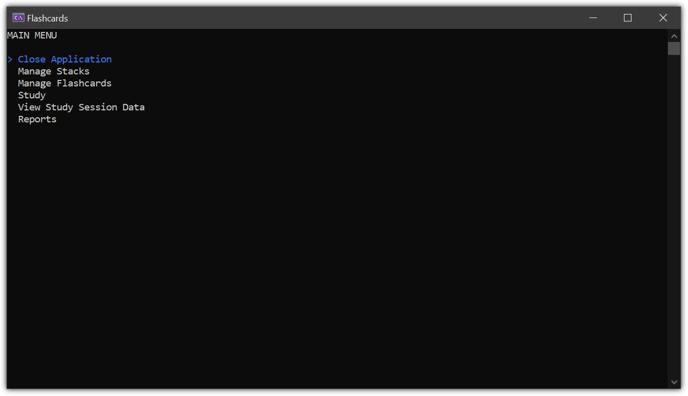

# Flashcards

The [Flashcards](https://www.thecsharpacademy.com/project/14/flashcards) project is quite complex compared to previous projects in [The C# Academy](https://www.thecsharpacademy.com/) curriculum. It introduces DTOs (Data Transfer Objects) and Microsoft SQL Server. I originally created the project using nothing but ADO.NET. Then I switched most of the Display methods and all of the FlashcardsController methods to use Dapper. That helped me better understand the difference between the two. I did the same for DTOs. I built the whole project first without any and then added a FlashcardDTO for use in place of the Flashcard class when the StackId was not needed. I also increased my use of Spectre.Console by using more selection menus where the user can simply use the arrow keys to make selections instead of typing. 

## Requirements

- [x] This is an application where the users will create stacks of flashcards.
- [x] You'll need two different tables for stacks and flashcards. The tables should be linked by a foreign key.
- [x] Stacks should have an unique name.
- [x] Every flashcard needs to be part of a stack. If a stack is deleted, the same should happen with the flashcard.
- [x] You should use DTOs to show the flashcards to the user without the Id of the stack it belongs to.
- [x] When showing a stack to the user, the flashcard Ids should always start with 1 without gaps between them. If you have 10 cards and number 5 is deleted, the table should show Ids from 1 to 9.
- [x] After creating the flashcards functionalities, create a "Study Session" area, where the users will study the stacks. All study sessions should be stored, with date and score.
- [x] The study and stack tables should be linked. If a stack is deleted, it's study sessions should be deleted.
- [x] The project should contain a call to the study table so the users can see all their study sessions. This table receives insert calls upon each study session, but there shouldn't be update and delete calls to it.

## Challenge

- [x] Create reports to see the number of sessions per month per stack, and another one to see the average score per month per stack. This is not an easy challenge if you’re just getting started with databases, but it will teach you all the power of SQL and the possibilities it gives you to ask interesting questions from your tables. You'll need to learn about pivot tables to complete this challenge.

