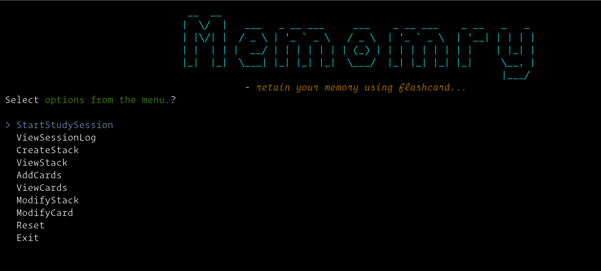
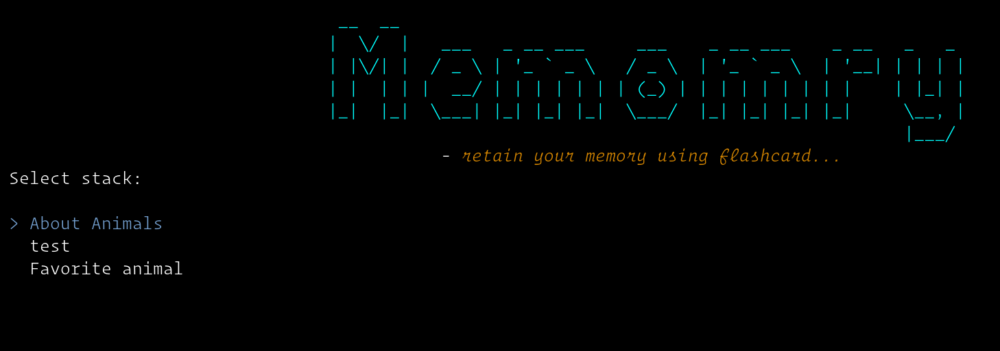
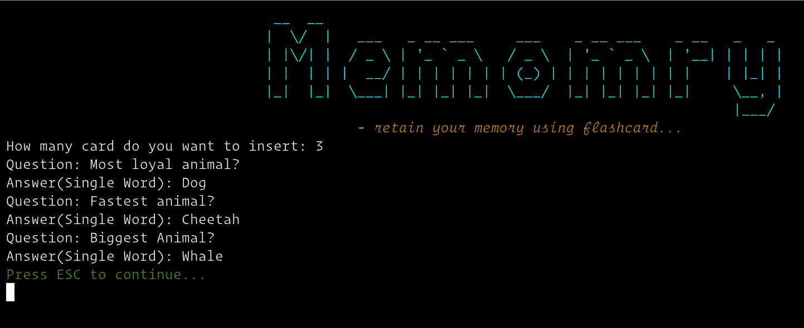
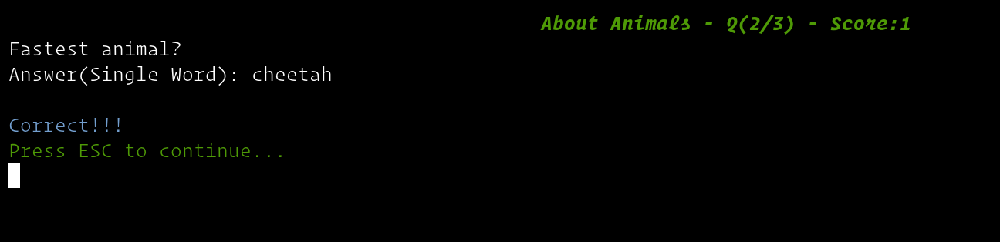
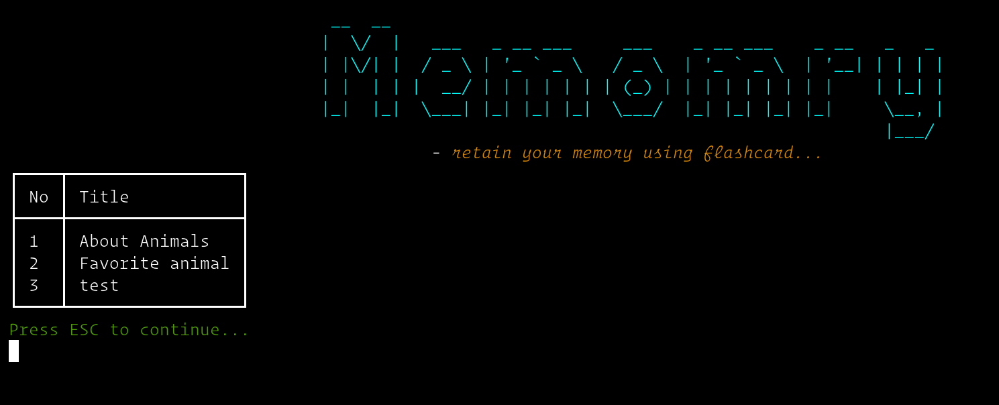
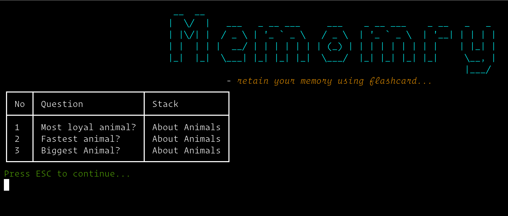
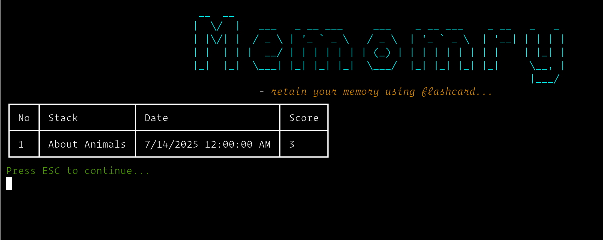

# MEMORY
#### *- retain your memory using flashcard...*

---------------

### Tech
- .NET(v8.0).
- MSSQL.
- [Dapper](https://www.learndapper.com).
- [DotNetEnv](https://www.nuget.org/packages/DotNetEnv/1.2.0)
- [Spectre.Console](https://spectreconsole.net)

### Features
- Keyboard Based Navigation.
  
- Easier selection based Inputs & Logging.
  
- Easy way to insert multiple card.
  
- Study Session.
  
- Tabular View of Stacks, Cards and Logs.
  - Stack
    
  - Card
    
  - Study Log
    

### Uses

- #### Clone Repo.
  `git clone https://github.com/devjunaeid/DotNETConsole.Flashcards.git`

- #### Go to the project folder and restore
    `dotnet restore`

- #### Create a `.env` file in the root folder

- #### Set `DB_CONNECTION_STRING` to the `.env` file

- #### Build
    `dotnet build`

- #### Run
    `dotnet run`

**Note(optional):** If you have already build an old version of this app, use `Reset`
option to sync DB Schema changes(All data will be destroyed).
