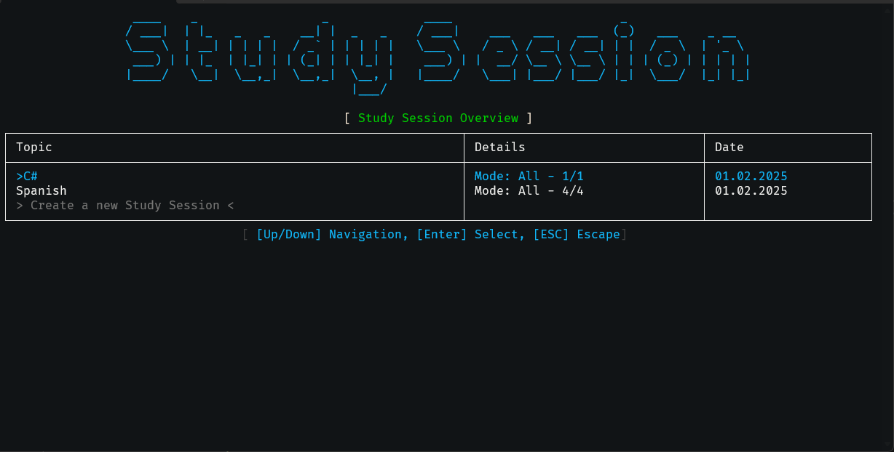

# Flashcards App

The **Flashcards App** is an interactive console application
designed to help you create, manage, and study various topics efficiently.

Inspired by the [C# Academy Flashcards Project](https://thecsharpacademy.com/project/14/flashcards).

## 📸 Overview

## Features

- **Stack Management:** Create and organize flashcard stacks based on different topics.
- **Flashcard Operations:** Add, update, and delete flashcards within each stack.
- **Study Sessions:** Engage in interactive study sessions with different modes:
  - **All Flashcards**
  - **Only Unsolved Flashcards**
  - **Only Solved Flashcards**
- **Session History:** Track and review past study sessions.

## How It Works

1. **Launch the app.**
2. **Navigate the menu** using arrow keys.
3. **Manage Stacks:** Create, update, or delete stacks.
4. **Manage Flashcards:** Add, edit, or remove flashcards within stacks.
5. **Start a Study Session:** Select a mode and answer questions interactively.
6. **Track Progress:** View past study sessions and track solved flashcards.
7. **Exit the app** by selecting the exit option.

## Technologies Used

- **Spectre.Console:** Interactive console UI.
- **MSSQL:** For storing and managing Sessions data.
- **Dapper:** Interaction with the database.

